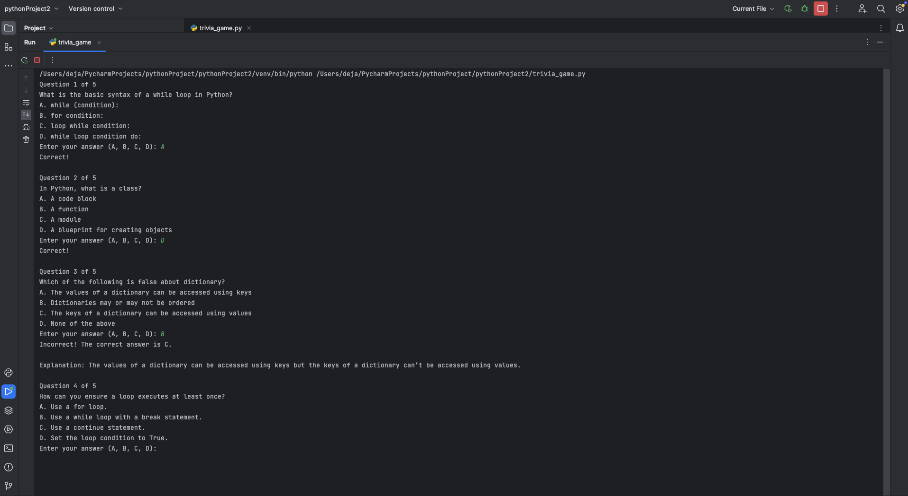

# Python Quiz Game

 

## Description

Python Trivia Game is a cool, interactive quiz application designed to test and expand your knowledge of Python. With randomly selected multiple-choice questions and instant feedback, it offers a fast and engaging way to sharpen your Python skills and challenge yourself.

## Features

🎲 **Randomized Questions**  
Every time a set of new questions is randomly selected for each new game.  
✅ **Multiple-Choice Format**  
Answer each question by choosing from four options.   
⚡ **Instant Feedback**  
You immediately receive feedback on whether your answer was correct or not.  
📈 **Live Score Updates**  
Your score is updated as you play, helping you track your progress.  
⏱ **Fast-Paced Fun**  
Each game includes 5 questions for a fast, enjoyable learning experience.  

## Getting Started

1. **Clone the Repository:** Clone this repository to your local machine using Git.

  ```
  git clone https://github.com/Khadejia/Python_Trivia_Game.git

  ```
2. **Run the Quiz Game:** Execute the Python script to start the quiz.

  ```
  python trivia_game.py

  ```

## Contributing

Contributions to this project are welcome! Whether you want to:
- Add new questions
- Improve the codebase
- Fix bugs or issues
- Enhance the user experience
Please feel free to open a pull request.

## Support
If you find this project helpful or enjoyable:
- Give the repository a ⭐️
- Share it with others
- Follow the creator on GitHub to stay updated with future projects
Your support is greatly appreciated!
